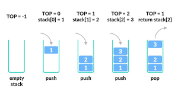

 
  

 

# Stack: A Fundamental Data Structure
A **stack** is a linear data structure that follows the **LIFO (Last In, First Out)** principle. This means the last element added to the stack is the first one to be removed. Stacks are widely used in programming for tasks like function call management, undo operations, and expression evaluation.

## Characteristics of a Stack:
1. **LIFO Principle**: The last element added is the first to be removed.
2. **Core Operations**:
   - **Push**: Add an element to the top of the stack.
   - **Pop**: Remove and return the top element of the stack.
   - **Peek/Top**: Retrieve the top element without removing it.
   - **isEmpty**: Check if the stack is empty.

## Visualization:
Think of a stack of plates:
- **Push**: Adding a plate to the top.
- **Pop**: Removing the top plate.
- The plate at the bottom is only accessible after removing all the plates above it.

 
  

## Applications of Stacks:
1. **Function Call Management**: Managing function calls and returns in programming languages.
2. **Expression Evaluation**: Converting and evaluating infix, postfix, or prefix expressions.
3. **Undo Mechanisms**: Supporting undo operations in text editors.
4. **Parenthesis Matching**: Validating balanced parentheses in expressions.
5. **Depth-First Search (DFS)**: Used in graph and tree traversal.

## Summary
A stack is a simple yet powerful data structure that is essential in various computational processes. Python provides multiple ways to implement stacks, offering flexibility for different use cases. Whether you use lists or `deque`, understanding the LIFO behavior and applications of stacks is crucial for solving complex programming problems efficiently.
